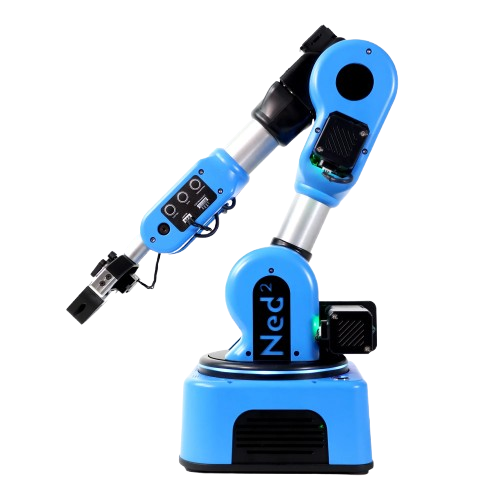

Welcome to Ned2/Ned3pro ROS Stack's documentation!
##################################################

This documentation contains everything you need to understand the robot's functioning and how to control it through ROS.

It is made as well for users who are using the "physical" robot as for those who want to use a virtual version.

|ned2| |ned3pro|

********
Preamble
********

Before diving into the software’s documentation, you can learn more about the robot development in the :doc:`Overview <packages/overview>` section.
   
Then, you should check the :doc:`Getting started <installation/getting_started>` section to setup your environment and try out the stack by yourself. If you 
don't have a real robot at your disposal, you can still simulate it via the :doc:`Use the robot through simulation <introduction/simulation>` section.

****************************
Ned robot Control via ROS
****************************

Ned robots are fully based on ROS.

ROS Direct control
------------------

.. important::
   To control the robot directly with ROS, you will need either to be connected in SSH
   to the physical robot, or to use the simulation.

ROS is the most direct way to control the robot. It allows you to:

- Send commands via the terminal in order to call services, trigger actions, ...
- Write an entire Python/C++ node to realize a full process.

See :doc:`ROS <packages/high_level>` section to see all Topic & Services available.

Python ROS Wrapper
------------------
.. important::
   To use Python ROS Wrapper, you will need either to be connected in SSH
   to the physical robot, or to use the simulation.

The Python ROS Wrapper is built on top of ROS to allow a faster development than ROS.
Programs are run directly on the robot which allows to trigger them with the robot's button
once a computer is no longer needed.

See :doc:`Python ROS Wrapper <packages/ros_wrapper>` to see which functions are accessible and examples on
how to use them.

.. toctree::
   :caption: Contents:
   :maxdepth: 2

.. toctree::
   :caption: Introduction
   :maxdepth: 1

   introduction/overview
   introduction/use_your_robot
   introduction/simulation
   introduction/quick_start

.. toctree::
   :caption: Installation
   :maxdepth: 1

   installation/getting_started
   installation/install_for_ubuntu_20
   installation/deploy_with_docker

.. toctree::
   :caption: Packages
   :maxdepth: 2

   packages/overview
   packages/common_interfaces
   packages/high_level
   packages/low_level
   packages/third_parties
   packages/ros_wrapper

.. toctree::
   :caption: To go further...
   :maxdepth: 1

   to_go_further/tcp_server
   Pyniryo <https://docs.niryo.com/api/pyniryo/>
   Modbus <https://docs.niryo.com/api/modbus/>
   Niryo studio <https://docs.niryo.com/niryostudio/>

.. toctree::
   :caption: Changelog
   :maxdepth: 1

   changelog_link

Indices and tables
==================

* :ref:`genindex`
* :ref:`modindex`
* :ref:`search`
