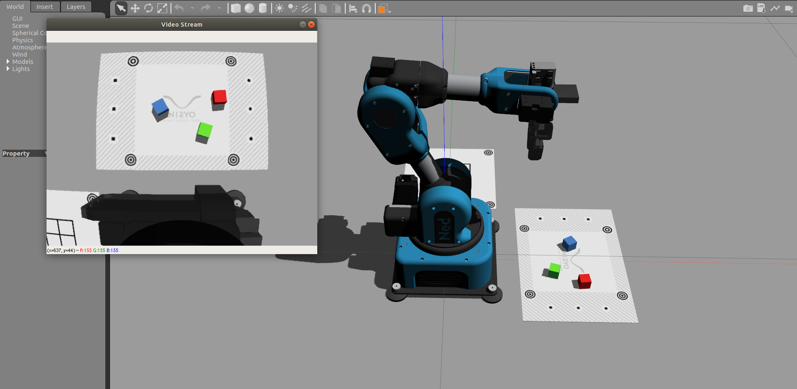
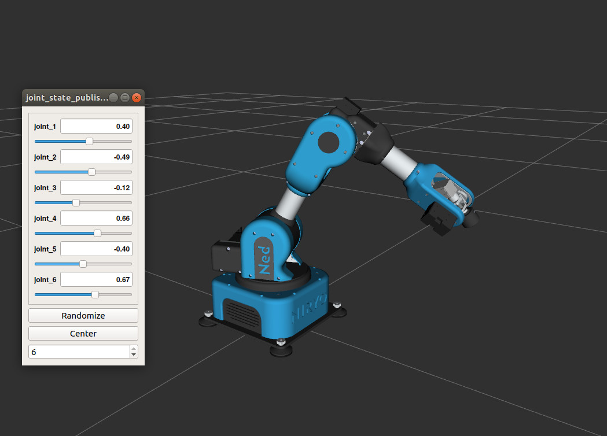
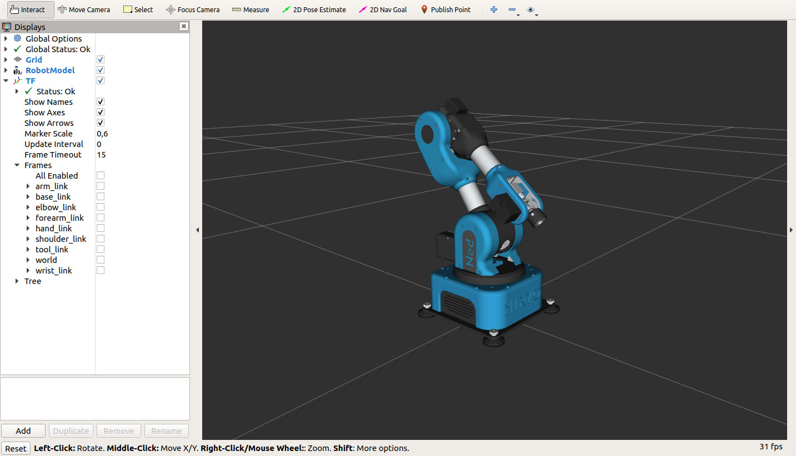
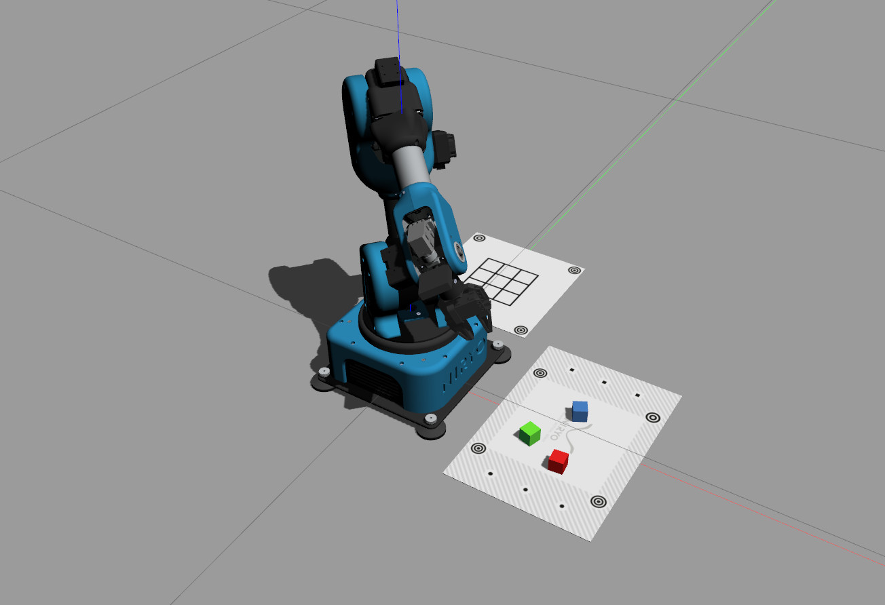

******************************
Use Niryo robot via simulation
******************************

The simulation allows to control a virtual Ned directly from
your computer.

In this tutorial, you will learn how to setup a robot simulation on a computer.

.. note::
    You can use :niryo_studio_simulation:`Niryo studio with the simulation <>`.
    To do so, you just have to connect Niryo Studio to "Localhost".

Simulation environment installation
===================================

.. attention::
    The whole ROS Stack is developed and tested on ROS **Noetic** which requires
    **Ubuntu 20.04** to run correctly. The use of another ROS version or OS
    may lead to malfunctions of some packages. Please follow the steps in 
    :ref:`Ubuntu 20.04 installation <install_for_ubuntu_20>` to install a working environment.

Simulation usage
================

.. important::
    - Hardware features are simulated as if you were using a real robot.
    - The data returned by the faked drivers is arbitrary and immutable. Among this data, 
      you will have : voltage, temperature, error state (always 0), ping (always true), 
      end effector state (immutable)

| The simulation is a powerful tool allowing to test new programs directly on your computer
 which prevents to transfer new code on the robot.
| It also helps for developing purpose → no need to transfer code, compile and restart the robot
 which is way slower than doing it on a desktop computer.

Without physics - No visualization
----------------------------------

This mode is mainly for simulation and tests purpose, bringing you in the closest state as possible to
a real robot control. It is available for all currently supported architectures.
You can access it by using the commands:

- Ned2 simulation

.. code:: bash

    roslaunch niryo_robot_bringup niryo_ned2_simulation.launch

- Ned3pro simulation

.. code:: bash

    roslaunch niryo_robot_bringup niryo_ned3pro_simulation.launch

This mode is useful if your CPU capacity is limited or if you don't have X server available.

Options
^^^^^^^
This mode is the more flexible one, as it provides all the possible options to customize the simulation.
For the other simulation modes (with RViz and Gazebo) we will just force some of these parameters to specific values.

.. list-table:: Simulation without visualization Options
   :header-rows: 1
   :widths: auto
   :stub-columns: 0
   :align: center

   *  - Name
      - Default Value 
      - Description
   *  - log_level
      - INFO
      - Log level to display for ROS loggers
   *  - ttl_enabled
      - true
      - Enable or disable the TTL bus usage. This feature is used for debug mainly and can lead to an unstable stack.
   *  - can_enabled
      - true
      - Enable or disable the CAN bus usage. This feature is used for debug mainly and can lead to an unstable stack.
   *  - debug
      - false
      - Launch in debug mode. For development and debug only.
   *  - conf_location
      - version.txt
      - Location of the version.txt file. A path to the file is required.
   *  - simu_gripper
      - true
      - Simulate the presence of a gripper id 11 on the bus
   *  - simu_conveyor
      - true
      - Simulate the presence of a conveyor on the bus (TTL)
   *  - vision_enabled
      - true
      - Enable the Vision Kit
   *  - gazebo
      - false
      - Enable gazebo specific parameters (However it does not launch gazebo, use gazebo specific launch file for that)

Without physics - RViz Visualization
------------------------------------

A simple visualization of the robot is possible via a tool called Rviz. 
This application will simulate the robot with its correct geometry and positions but without physics to avoid using too much CPU.

.. list-table:: Table of display launch Options
   :header-rows: 1
   :widths: auto
   :stub-columns: 0
   :align: center

   *  - Name
      - Default Value 
      - Description
   *  - hardware_version
      - ned2
      - Use the parameters dedicated to this specific hardware_version. Possible values are “ned2” or “ned3pro.

Control with trackbar
^^^^^^^^^^^^^^^^^^^^^

This visualization allows an easy first control of the robot, and helps to understand
joints disposal. You can access it by using the command:

.. code:: bash

    roslaunch niryo_robot_description display.launch hardware_version:=ned2 # ned2, ned3pro

Rviz should open with a window containing 6 trackbars. Each of these trackbars allows to control
the corresponding joint.

    Example of trackbars use.

Control with ROS
^^^^^^^^^^^^^^^^

| Not only `Rviz <http://wiki.ros.org/rviz>`_ can display the robot, but it can also be linked with ROS controllers to show the robot's actions
 from ROS commands!
| This method can help you debug ROS topics, services and also API scripts.

To run it:

.. code:: bash

    roslaunch niryo_robot_bringup desktop_rviz_simulation.launch

    Rviz opening, with the robot ready to be controlled with ROS!

RViz Visualization options
^^^^^^^^^^^^^^^^^^^^^^^^^^

.. list-table:: Table of RViz launch Options
   :header-rows: 1
   :widths: auto
   :stub-columns: 0
   :align: center

   *  - Name
      - Default Value 
      - Description
   *  - log_level
      - INFO
      - Log level to display for ROS loggers
   *  - hardware_version
      - ned2
      - Use the parameters dedicated to this specific hardware_version. Possible values are "ned2" or "ned3pro".
   *  - debug
      - false
      - Launch in debug mode. For development and debug only.
   *  - gui
      - true
      - Enable the gui visualization
   *  - conf_location
      - version.txt
      - Location of the version.txt file. A path to the file is required.
   *  - simu_gripper
      - false
      - Simulate the presence of a gripper id 11 on the bus (Visualisation of the tool will not be visible, whatever the value of this parameter)
   *  - simu_conveyor
      - false
      - Simulate the presence of a conveyor (Visualisation of the conveyor will not be visible, whatever the value of this parameter)

With physics - Gazebo Simulation
--------------------------------

For the simulation, Ned uses Gazebo, a well known tool among the ROS community.
It allows:

* Collision.
* World creation → A virtual environment in which the robot can deal with objects.
* Gripper & Camera using.

The Niryo Gripper 1 has been replicated in Gazebo.
The Camera is also implemented.

.. note::
    Gazebo also generates camera distortion, which brings the simulation even closer from the reality!

Launch Gazebo simulation
^^^^^^^^^^^^^^^^^^^^^^^^
A specific world has been created to use Ned in Gazebo with 2 workspaces.

To run it: ::

    roslaunch niryo_robot_bringup desktop_gazebo_simulation.launch

    Gazebo view, with the robot ready to be controlled with ROS!

.. note::
    You can edit Gazebo world to do your own! It's placed in the folder *worlds* of the package
    niryo_robot_gazebo.

Gazebo Simulation options
^^^^^^^^^^^^^^^^^^^^^^^^^

The user can disable 3 things by adding the specific string to the command line:

* the Gazebo graphical interface: `gui:=false`.
* the Camera & the Gripper - Vision & Gripper wise functions won't be usable: `gripper_n_camera:=false`.

.. hint::
    Gazebo can be very slow. If your tests do not require Gripper and Camera, consider using Rviz
    to alleviate your CPU.

.. list-table:: Table of Gazebo launch Options
   :header-rows: 1
   :widths: auto
   :stub-columns: 0
   :align: center

   *  - Name
      - Default Value 
      - Description
   *  - log_level
      - INFO
      - Log level to display for ROS loggers
   *  - hardware_version
      - ned2
      - Use the parameters dedicated to this specific hardware_version. Possible values are "ned2" or "ned3pro".
   *  - debug
      - false
      - Launch in debug mode. For development and debug only.
   *  - gui
      - true
      - Enable the gui visualization
   *  - conf_location
      - version.txt
      - Location of the version.txt file. A path to the file is required.
   *  - gripper_n_camera
      - true
      - Simulate the presence of a gripper id 11 and a camera on the bus 
   *  - simu_conveyor
      - true
      - Simulate the presence of a conveyor (Visualisation of the conveyor will not be visible, whatever the value of this parameter)
