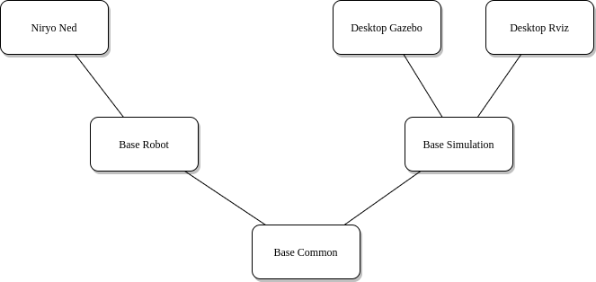

Niryo robot bringup
###################

This packages provides config and launch files to start the robotic stack packages with various parameters.

Launch files are placed in the *launch* folder. Only files with **.launch** extension can be executed.

   Bring Up Launch Files' organization

On RaspberryPI
**************

Ned2
----

| The file **niryo_ned2_robot.launch** allows to launch ROS on a Raspberry Pi 4.
| This file is automatically launched when Ned2 boots (Ned2 RPi4B image).

Command to launch Ned2's ROS Stack

.. code:: bash

   roslaunch niryo_robot_bringup niryo_ned2_robot.launch

Ned3pro
-------

| The file **niryo_ned3pro_robot.launch** allows to launch ROS on a Raspberry Pi 4.
| This file is automatically launched when Ned3pro boots (Ned3pro RPi4B image).

Command to launch Ned's ROS Stack

.. code:: bash

   roslaunch niryo_robot_bringup niryo_ned3pro_robot.launch

On Desktop (Simulation)
***********************

As the simulation happens on a computer, the hardware-related stuff is not used.

For both of following launch files, you can set:
 - *gui* to "false" in order to disable graphical interface.

Gazebo simulation
-----------------

Run Gazebo simulation. The robot can do everything that is not hardware-related:
 - move, get_pose.
 - use the camera (to disable it, set "camera" parameter to 'false').
 - use the Gripper 1 (to disable it, set "simu_gripper" parameter to 'false').
 - save/run programs, go to saved pose, ...

Command to launch the simulation:

.. code:: bash

   roslaunch niryo_robot_bringup desktop_gazebo_simulation.launch

To disable camera & gripper:

.. code:: bash

   roslaunch niryo_robot_bringup desktop_gazebo_simulation.launch gripper_n_camera:=false

To run it with a specific hardware version, use the command:

.. code:: bash

   roslaunch niryo_robot_bringup desktop_gazebo_simulation.launch hardware_version:=ned3pro  # ned2, ned3pro

Rviz simulation
---------------

Run Rviz simulation. You can access same features as Gazebo except Camera & Gripper.

To run it, use the command:

.. code:: bash

   roslaunch niryo_robot_bringup desktop_rviz_simulation.launch

To run it with a specific hardware version, use the command:

.. code:: bash

   roslaunch niryo_robot_bringup desktop_rviz_simulation.launch hardware_version:=ned3pro  # ned2, ned3pro

Notes
*****

The following files are used to configure the robot logs:
 * *desktop_gazebo_simulation_trace.conf*
 * *desktop_rviz_simulation_trace.conf*
 * *niryo_robot_trace.conf*