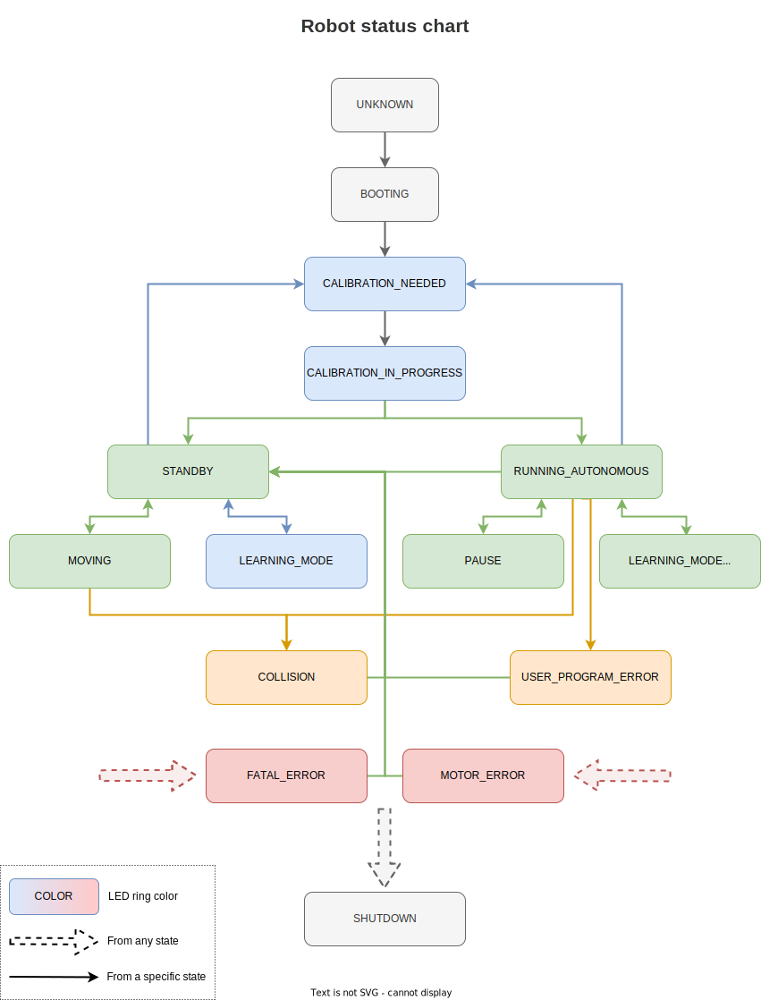

Niryo robot status
##################

The package listens to robot topics to deduce its current state.
It manages the status of the robot, the status of the logs and informs about the overheating of the Raspberry PI and the joints out of bounds.

It belongs to the ROS namespace: |namespace_emphasize|.

Robot status
************

.. list-table:: Niryo Robot Status Table
   :header-rows: 1
   :widths: auto

   *  -  Name
      -  Description
      -  Troubleshoot
   *  -  ``UPDATE``
      -  Robot update in progress
      -  Just wait and be patient :)
   *  -  ``REBOOT``
      -  The robot is rebooting
      - 
   *  -  ``SHUTDOWN``
      -  The robot is being shutdown
      -
   *  -  ``FATAL_ERROR``
      -  ROS crash
      -  Please restart the robot
   *  -  ``MOTOR_ERROR``
      -  Motor voltage error, overheating, overload
      -  |  Check the error code on Niryo Studio.
         |  Restart the robot and check the wiring.
         |  If the problem persists, contact customer service
   *  -  ``COLLISION``
      -  Arm collision detected
      -  Restart your movement or switch to learning mode to remove this error.
   *  -  ``USER_PROGRAM_ERROR``
      -  User program error
      -  Launch a movement or switch to learning mode to remove this error.
   *  -  ``UNKNOWN``
      -  Node not initialized
      -
   *  -  ``BOOTING``
      -  ROS a and the Raspberry are booting up
      -  | If the startup seems to timeout, restart the robot electrically.
         | If the problem persists, update the robot with ssh,
         | change the SD card or contact customer service.
   
   *  -  ``CALIBRATION_NEEDED``
      -  New calibration requested
      -  Run a new calibration before processing any movement.
   *  -  ``CALIBRATION_IN_PROGRESS``
      -  Calibration in progress (`Ned2` only)
      -  |  If the calibration fails or takes longer than 30 seconds.
         | The status will return to ``CALIBRATION_NEED.``
   *  -  ``LEARNING_MODE``
      -  Free motion enabled, the torques are disabled
      -
   *  -  ``STANDBY``
      -  | Free motion disabled, the torques are enabled
         | and no user program is running
      -
   *  -  ``MOVING``
      -  | A single motion or jog is being processed
         | and no user program is running
      -
   *  -  ``RUNNING_AUTONOMOUS``
      -  A user program is running and the torques are enabled
      -
   *  -  ``RUNNING_DEBUG``
      -  A debug procedure is running
      -  A short press on the top button cancels it.
   *  -  ``PAUSE``
      -  User program error
      -  | A short press on the top button resumes the program,
         | a long press (on Ned2) cancels the program execution.
         | After 30 seconds, the program stops automatically.
   *  -  ``LEARNING_MODE_AUTONOMOUS``
      -  A user program is running and the torques are disabled
      -
   *  -  ``LEARNING_TRAJECTORY``
      -  The robot is generating a trajectory from its motions
      - 
   *  -  ``ESTOP``
      - The robot is in emergency stop (`Ned3pro` only)
      - You must release the emergency stop button 

Robot status API functions
**************************

Robot status ROS wrapper
------------------------

In order to control the robot more easily than calling each topics & services one by one,
a Python ROS Wrapper has been built on top of ROS.

For instance, a script which shutdowns the robot via Python ROS Wrapper will looks like: 

.. code:: python

    from niryo_robot_status.api import RobotStatusRosWrapper

    robot_status = RobotStatusRosWrapper()
    robot_status.shutdown()

API list
--------

.. automodule:: niryo_robot_status.api.robot_status_ros_wrapper
   :members:
   :undoc-members:
   :show-inheritance:
   :noindex:

Package Documentation
*********************

.. rosdoc:: /niryo_robot_status
    :description_file: packages/descriptions.yaml
    :package_path_for_rosdoc_lite: ../niryo_robot_status

The RobotStatus message
--------------------------

.. literalinclude:: /../niryo_robot_status/msg/RobotStatus.msg
    :language: python

.. |namespace_emphasize| replace:: ``/niryo_robot_status``

