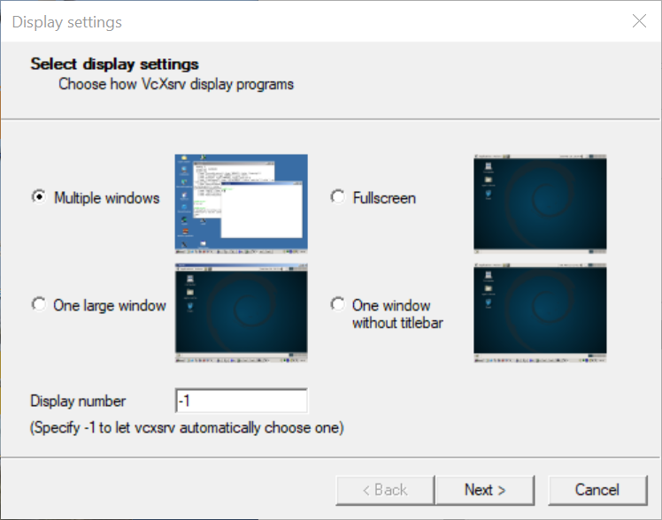
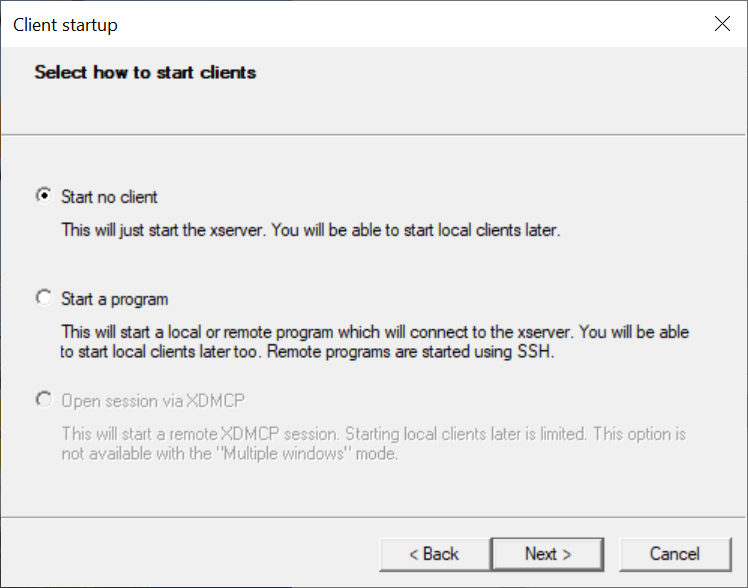
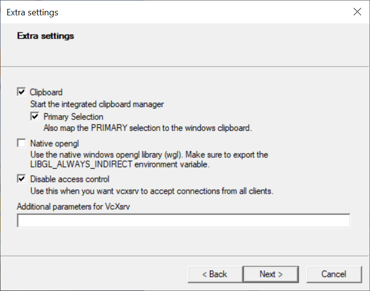

Windows Subsystem for Linux installation (experimental)
========================================================

Microsoft is developping since 2016 a compatibility layer for running Linux binary executables natively on Windows 10. With the version 2 issued in 2019,
this "hidden Linux kernel" is now mature enough to run complex operations like the full ROS stack [2]_.

Thus you will be able to run simulations for the Ned, Niryo One or Ned2 robots on a Windows machine.

.. note::
    You have to be running Windows 10 version 2004 (Build 19041) or higher for WSL2 to work.

.. warning::
    The installation under WSL is not originally supported by Niryo, this guide is provided on an indicative basis only.

The following guide is mainly adapted from this blog post from Jack Kawell, feel free to refer to it for more complete information [1]_

Install WSL2 [3]_
------------------

1. Enable Windows Subsystem for Linux on your machine (in a powershell terminal)

.. code::
    
    dism.exe /online /enable-feature /featurename:Microsoft-Windows-Subsystem-Linux /all /norestart

2. Update WSL to use version 2 (in a powershell terminal)

.. code::

    dism.exe /online /enable-feature /featurename:VirtualMachinePlatform /all /norestart

3. You then need to restart your machine to finish the WSL installation and the upgrade to WSL2.

4. Set default version of WSL to 2 (in a powershell terminal)

.. code::

    wsl --set-default-version 2

5. Install an Ubuntu 18.04 distribution using the Windows Store

.. figure:: ../../images/installation/windows_store.png
   :alt: Windows Store
   :height: 400px
   :align: center

   Ubuntu 18.04 in the Windows Store

6. Launch the app. The first time, it asks you to finish the initialization of the OS.

Your Ubuntu OS is now ready. You can continue the build of the stack using the tutorial.

Setting up GUI forwarding
--------------------------

WSL does not come with an X server. Thus, you will not be able to launch any graphical windows for now. 
But we can change this by using a Windows X server and forward the GUI to it using GUI forwarding.

Many X servers exist for Windows 10. We tested VcXsrc, and it correctly does the job.
https://sourceforge.net/projects/vcxsrv/

1. Launch VcXsrv. Be sure to have the following options :
- Uncheck "Native OpenGL"
- Check "Disable access control"

.. note:: 

    You can directly use this configuration by using this :download:`configuration file <../../resources/installation/wsl_config.xlaunch>`

2. You need to export the address of your Xserver in Ubuntu 18 to forward the GUI

.. code::

    export DISPLAY=$(cat /etc/resolv.conf | grep nameserver | awk '{print $2}'):0

You can add this to your bashrc file.

3. You can check that your forwarding works by using simple X11 apps for example:

.. code::

    sudo apt update
    sudo apt install x11-apps
    xcalc

4. Install ROS Melodic (see instructions here)

5. Try launching Rviz

.. code::

    roscore & rosrun rviz rviz

6. You should now be able to launch any simulation of the One, Ned or Ned2 using Rviz or Gazebo

Troubleshooting
----------------

**Error: Can't open display: 192.168.1.44:0.0**
Your DISPLAY variable does not match the address of your XServer.

Try :
    - Check that you correctly launched your XServer with the required options (Disable access control is essential)
    - Check that the IP you gave is correct (you need the address in /etc/resolv.conf to have it work)

**OpenGL issues**
Some people have said that they run into issues with OpenGL applications like Rviz. 
If you do, try setting the environment variable LIBGL_ALWAYS_INDIRECT=0 in your WSL2 terminal 
(you can just add export LIBGL_ALWAYS_INDIRECT=0 to the end of your .bashrc file).

.. [1] `<https://jack-kawell.com/2020/06/12/ros-wsl2/>`_

.. [2] `<https://docs.microsoft.com/en-us/windows/wsl/compare-versions>`_

.. [3] `<https://docs.microsoft.com/en-us/windows/wsl/install-win10>`_
