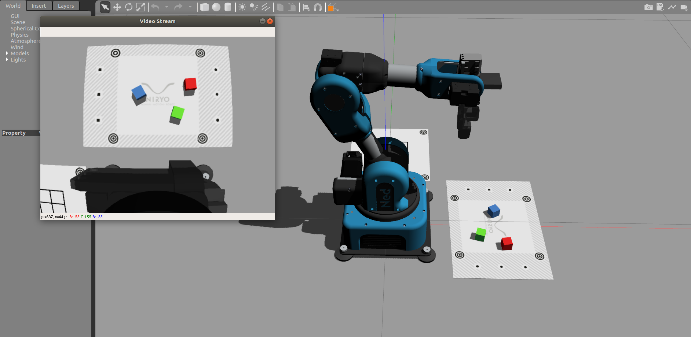

*******************************************
Use Niryo robot through simulation
*******************************************

The simulation allows to control a virtual Ned directly from
your computer.

    Ned in Gazebo Simulation

In this tutorial, you will learn how to setup simulation on a computer.

.. note::
    You can use :niryo_studio_simulation:`Niryo Studio with the simulation<>`.
    To do so, you just have to connect Niryo Studio to "Localhost".

Simulation environment installation
=========================================

.. attention::
    The whole ROS Stack is developed and tested on ROS **Melodic** which requires
    **Ubuntu 18.04** to run correctly. The using of another ROS version or OS
    may lead to malfunctions of some packages.

To allow the simulation to run on your computer, you will need to install ROS and some
packages.

Installation index:

.. contents::
   :local:
   :depth: 1

Prepare environment
-------------------------
.. note::
    All terminal command listed are for Ubuntu users.

Place yourself in the folder of your choice and create a folder
**catkin_ws_niryo_ned** as well as a sub-folder **src**: ::

    mkdir -p catkin_ws_niryo_ned/src

Then go to the folder **catkin_ws_niryo_ned** and
clone Ned repository in the folder **src**.
For the future operation, be sure to stay in the **catkin_ws_niryo_ned** folder: ::

    cd catkin_ws_niryo_ned
    git clone https://github.com/NiryoRobotics/ned_ros src

Install ROS dependencies
------------------------------------

Install ROS
^^^^^^^^^^^^^

You firstly need to install ROS Melodic. To do so, follow the ROS official tutorial
`here <http://wiki.ros.org/melodic/Installation/Ubuntu>`_ and chose the
**Desktop-Full Install**.

Install additional packages
^^^^^^^^^^^^^^^^^^^^^^^^^^^^^^^^^^^^^^
To ensure the functioning of all Ned's packages, you need to
install several more packages:

Method 1: Quick installation via ROSDep
"""""""""""""""""""""""""""""""""""""""""""""""""
For each packages, we have referenced all the dependencies in their respective
*package.xml* file, which allow to install each dependency via *rosdep* command: ::

 rosdep update
 rosdep install --from-paths src --ignore-src --default-yes --rosdistro melodic --skip-keys "python-rpi.gpio"

Method 2: Full installation
"""""""""""""""""""""""""""""""""""""""""""""""""

ROS packages needed are:

* build-essential
* catkin
* python-catkin-pkg
* python-pymodbus
* python-rosdistro
* python-rospkg
* python-rosdep-modules
* python-rosinstall python-rosinstall-generator
* python-wstool

To install a package on Ubuntu: ::

    sudo apt install <package_name>

Melodic specific packages needed are:

* moveit
* control
* controllers
* tf2-web-republisher
* rosbridge-server
* joint-state-publisher-gui

To install a ROS Melodic's package on Ubuntu: ::

    sudo apt install ros-melodic-<package_name>

Setup Ned ROS environment
--------------------------------

.. note::
    Be sure to be still placed in the **catkin_ws_niryo_ned** folder.

Then perform the **make** of Ned's ROS Stack via the command: ::

    catkin_make

If no errors occurred during the **make** phase, the setup
of your environment is almost complete!

It is necessary to source the configuration file to add all Ned
packages to ROS environment. To do so, run the command: ::

    source devel/setup.bash

It is necessary to run this command each time you launch a new terminal.
If you want to make this sourcing appends for all your futur terminals,
you can add it to your **bashrc** file: ::

    echo "source $(pwd)/devel/setup.bash" >> ~/.bashrc
    source ~/.bashrc

Installation is now finished!

Simulation utilization
=========================================

.. important::
    - If you haven't follow the step of
      :ref:`Simulation Environment Installation <source/simulation:Simulation Environment Installation>`.
      you won't be able to use the simulation.
    - Hardware features won't be accessible.

| The simulation is a powerful tool which allow to test new programs directly on your computer
 which prevent to transfer new code on the robot.
| It also helps for developing purpose → no need to transfer code, compile and restart the robot
 which is way slower than doing it on a desktop computer.

Without physics - Visualization
--------------------------------------

The visualization happens with Rviz which is a powerful tool.

Control with trackbar
^^^^^^^^^^^^^^^^^^^^^^^^^^

This visualization allows an easy first control of the robot, and helps to understand
joints disposal. You can access it by using the command: ::

    roslaunch niryo_robot_description display.launch

Rviz should open with a window containing 6 trackbars. Each of these trackbars allows to control
the corresponding joint.

.. figure:: ../images/visu_rviz_trackbar.jpg
    :alt: Ned on Rviz

    Example of trackbars use.

Control with ROS
^^^^^^^^^^^^^^^^^^^^^^^^^^

| Not only Rviz can display the robot, it can also be linked with ROS controllers to show robot's actions
 from ROS commands!
| This method can help you debugging ROS topics, services and also, API scripts.

To run it: ::

    roslaunch niryo_robot_bringup desktop_rviz_simulation.launch

.. figure:: ../images/visu_rviz_ros.jpg
    :alt: Ned on Rviz

    Rviz opening, with the robot ready to be controlled with ROS!

With physics - Simulation
--------------------------------------

For the simulation, Ned uses Gazebo, a well known tool among the ROS community.
It allows:

* Collision.
* World creation → An virtual environment in which the robot can deal with objects.
* Gripper & Camera using.

The Niryo Gripper 1 has been replicated in Gazebo.
The Camera is also implemented.

.. note::
    Gazebo also generates camera distortion, which brings the simulation even closer from the reality!

Launch simulation
^^^^^^^^^^^^^^^^^^^^^^^^^^
A specific world has been created to use Ned in Gazebo with 2 workspaces.

To run it: ::

    roslaunch niryo_robot_bringup desktop_gazebo_simulation.launch

.. figure:: ../images/simulation_gazebo_2.jpg
    :alt: Ned on Gazebo

    Gazebo view, with the robot ready to be controlled with ROS!

.. note::
    You can edit Gazebo world to do your own! It's placed in the folder *worlds* of the package
    niryo_robot_gazebo.

Simulation option
^^^^^^^^^^^^^^^^^^^^^^^^^^

The user can disable 3 things by adding the specific string to the command line:

* the Gazebo graphical interface: `gui:=false`.
* the Camera & the Gripper - Vision & Gripper wise functions won't be usable: `gripper_n_camera:=false`.

.. hint::
    Gazebo can be very slow. If your tests do not need Gripper and Camera, consider using Rviz
    to alleviate your CPU.
