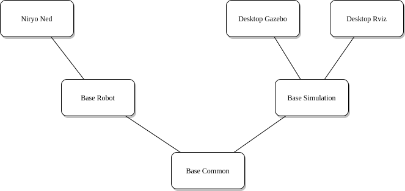

Niryo_robot_bringup
==============================
This packages provides config and launch files to start Ned and ROS packages with various parameters.

Launch files are placed in the *launch* folder. Only files with **.launch** extension can be executed.

   Bring Up Launch Files' organization

On RaspberryPI
-------------------------

One
^^^^^^^^^^^^^^^^^^

| The file **niryo_one_robot.launch** allows to launch ROS on a Raspberry Pi 3.
| This file is automatically launched when Niryo One boots (Niryo One RPi3B image).

Command to launch Niryo One's ROS Stack::

 roslaunch niryo_robot_bringup niryo_none_robot.launch

Ned
^^^^^^^^^^^^^^^^^^

| The file **niryo_ned_robot.launch** allows to launch ROS on a Raspberry Pi 4.
| This file is automatically launched when Ned boots (Ned RPi4B image).

Command to launch Ned's ROS Stack::

 roslaunch niryo_robot_bringup niryo_ned_robot.launch

Ned2
^^^^^^^^^^^^^^^^^^

| The file **niryo_ned2_robot.launch** allows to launch ROS on a Raspberry Pi 4.
| This file is automatically launched when Ned2 boots (Ned2 RPi4B image).

Command to launch Ned2's ROS Stack::

 roslaunch niryo_robot_bringup niryo_ned2_robot.launch

On Desktop (Simulation)
-------------------------

As the simulation happens on a computer, the hardware-related stuff is not used.

For both of following launch files, you can set:
 - *gui* to "false" in order to disable graphical interface.

Gazebo simulation
^^^^^^^^^^^^^^^^^^^^^^^^^^^^^^^^^^^^^^^

Run Gazebo simulation. The robot can do everything that is not hardware-related:
 - move, get_pose.
 - use the camera (to disable it, set "camera" parameter to 'false').
 - use the Gripper 1 (to disable it, set "simu_gripper" parameter to 'false').
 - save/run programs, go to saved pose, ...

Command to launch the simulation: ::

 roslaunch niryo_robot_bringup desktop_gazebo_simulation.launch

To disable camera & gripper: ::

 roslaunch niryo_robot_bringup desktop_gazebo_simulation.launch gripper_n_camera:=false

To run it with a specific hardware version, use the command: ::

 roslaunch niryo_robot_bringup desktop_gazebo_simulation.launch hardware_version:=ned  # one, ned2

Rviz simulation
^^^^^^^^^^^^^^^^^^^^^^^^^^^

Run Rviz simulation. You can access same features as Gazebo except Camera & Gripper.

To run it, use the command: ::

 roslaunch niryo_robot_bringup desktop_rviz_simulation.launch

To run it with a specific hardware version, use the command: ::

 roslaunch niryo_robot_bringup desktop_rviz_simulation.launch hardware_version:=ned  # one, ned2

Notes - Ned Bringup
------------------------------

*niryo_robot_base* files setup many rosparams,
these files should be launched before any other package.

The following files are used to configure the robot logs:
 * *desktop_gazebo_simulation_trace.conf*
 * *desktop_rviz_simulation_trace.conf*
 * *niryo_robot_trace.conf*