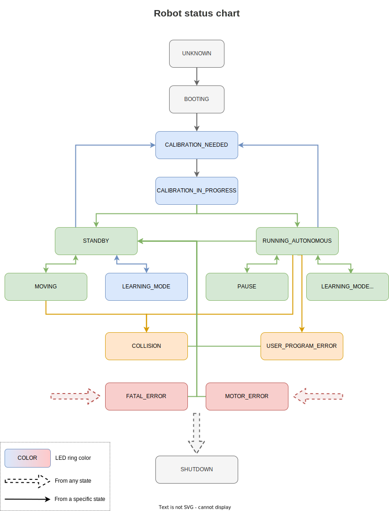

Niryo_robot_status
===========================================================

Robot status Node
--------------------------

The ROS Node is listening to the topics of the robot to deduce the current state of the robot.
It manages the status of the robot, the status of the logs and informs about the overheating of the Raspberry PI and the out of limit joints.

It belongs to the ROS namespace: |namespace_emphasize|.

.. list-table:: Niryo Robot Status Table
   :header-rows: 1
   :width: 100%
   :stub-columns: 0
   :align: center

   *  -  Name
      -  Description
      -  Troubleshoot
   *  -  ``SHUTDOWN``
      -  The robot is being shut down
      -
   *  -  ``FATAL_ERROR``
      -  ROS crash
      -  Please restart the robot
   *  -  ``MOTOR_ERROR``
      -  Motor voltage error, overheating, overload
      -  |  Check the error code on Niryo Studio.
         |  Restart the robot and check the wiring.
         |  If the problem persists, contact customer service
   *  -  ``COLLISION``
      -  Arm collision detected
      -  Restart your movement or switch to learning mode to remove this error.
   *  -  ``USER_PROGRAM_ERROR``
      -  User program error
      -  Launch a movement or switch to learning mode to remove this error.
   *  -  ``UNKNOWN``
      -  Node not initialized
      -
   *  -  ``BOOTING``
      -  ROS a and the Raspberry are booting up
      -  | If the startup seems to timeout, restart the robot electrically.
         | If the problem persists, update the robot with ssh,
         | change the SD card or contact customer service.
   *  -  ``UPDATE``
      -  Robot update in progress
      -  Just wait and be patient :)
   *  -  ``CALIBRATION_NEEDED``
      -  New calibration requested
      -  Run a new calibration before processing any movement.
   *  -  ``CALIBRATION_IN_PROGRESS``
      -  Calibration in progress
      -  |  If the calibration fails or takes longer than 30 seconds.
         | The status will return to ``CALIBRATION_NEED.``
   *  -  ``LEARNING_MODE``
      -  Free motion enabled, the torques are disabled
      -
   *  -  ``STANDBY``
      -  | Free motion disabled, the torques are enabled
         | and no user program is running
      -
   *  -  ``MOVING``
      -  | A single motion or jog is being processed
         | and no user program is running
      -
   *  -  ``RUNNING_AUTONOMOUS``
      -  A user program is running and the torques are enabled
      -
   *  -  ``RUNNING_DEBUG``
      -  A debug procedure is running
      -  A short press on the top button cancels it.
   *  -  ``PAUSE``
      -  User program error
      -  | A short press on the top button resumes the program,
         | a long press (on Ned2) or a double press (on Ned and One)
         | cancels the program execution.
         | After 30 seconds, the program stops automatically.
   *  -  ``LEARNING_MODE_AUTONOMOUS``
      -  A user program is running and the torques are disabled
      -

   Niryo Robot Status Diagram

Publisher - Robot Status
^^^^^^^^^^^^^^^^^^^^^^^^^^^^^^

.. list-table:: Robot Status Package's Publishers
   :header-rows: 1
   :widths: auto
   :stub-columns: 0
   :align: center

   *  -  Name
      -  Message Type
      -  Latch Mode
      -  Description
   *  -  ``/niryo_robot_status/robot_status``
      -  :ref:`RobotStatus<source/stack/high_level/niryo_robot_status:RobotStatus>`
      - ``True``
      -  Publish the robot, log, overheating and out of bounds status.

Services - Robot Status
^^^^^^^^^^^^^^^^^^^^^^^^^^^^^^^^^^^^^^^^

.. list-table:: Robot Status Services
   :header-rows: 1
   :widths: auto
   :stub-columns: 0
   :align: center

   *  -  Name
      -  Message Type
      -  Description
   *  -  ``/niryo_robot_status/advertise_shutdown``
      -  :ref:`Trigger<source/stack/high_level/niryo_robot_msgs:Trigger>`
      -  Notify of a shutdown request

Subscribers - Robot Status
^^^^^^^^^^^^^^^^^^^^^^^^^^^

.. list-table:: Robot Status Package subscribers
   :header-rows: 1
   :widths: auto
   :stub-columns: 0
   :align: center

   *  - Topic name
      - Message type
      - Description
   *  - ``/niryo_robot_hardware_interface/hardware_status``
      - :ref:`HardwareStatus<source/stack/high_level/niryo_robot_msgs:HardwareStatus>`
      -  Detection of a motor or end effector panel error, raspberry overheating
   *  - ``niryo_robot_rpi/pause_state``
      -  :ref:`PausePlanExecution<source/stack/high_level/niryo_robot_arm_commander:PausePlanExecution>`
      - Detection of the pause state
   *  - ``/niryo_robot_arm_commander/is_active``
      - :std_msgs:`std_msgs/Bool<Bool>`
      - Detection of a motion
   *  - ``/niryo_robot_arm_commander/is_debug_motor_active``
      - :std_msgs:`std_msgs/Bool<Bool>`
      - Detection of a debug procedure
   *  - ``/niryo_robot/jog_interface/is_enabled``
      - :std_msgs:`std_msgs/Bool<Bool>`
      - Detection of a jog motion
   *  - ``/niryo_robot_programs_manager/program_is_running``
      -  :ref:`ProgramIsRunning<source/stack/high_level/niryo_robot_programs_manager:ProgramIsRunning>`
      - Detection of a user program
   *  - ``/niryo_robot_user_interface/is_client_connected``
      - :std_msgs:`std_msgs/Bool<Bool>`
      - Detection of a pyniryo user
   *  - ``/niryo_robot/learning_mode/state``
      - :std_msgs:`std_msgs/Bool<Bool>`
      - Detection of the free motion mode
   *  - ``/niryo_robot_arm_commander/collision_detected``
      - :std_msgs:`std_msgs/Bool<Bool>`
      - Detection of collision
   *  - ``/joint_states``
      -  :std_msgs:`sensor_msgs/JointState<JointState>`
      - Get the joint state in order to detect an out of bounds
   *  - ``/ping_pyniryo``
      - :std_msgs:`std_msgs/Bool<Bool>`
      - Detection of a pyniryo2 user

Dependencies - Robot Status
^^^^^^^^^^^^^^^^^^^^^^^^^^^^^^^^^^^^^^^^^^

- :msgs_index:`std_msgs`
- :msgs_index:`sensor_msgs`
- :ref:`niryo_robot_msgs <source/stack/high_level/niryo_robot_msgs:Niryo_robot_msgs>`
- :ref:`niryo_robot_programs_manager <source/stack/high_level/niryo_robot_programs_manager:Niryo_robot_programs_manager>`
- :ref:`niryo_robot_arm_commander <source/stack/high_level/niryo_robot_arm_commander:Niryo_robot_arm_commander>`

Messages files - Robot Status
----------------------------------------------

RobotStatus
^^^^^^^^^^^^^^^^^^^^^^^^^^^^^

.. literalinclude:: ../../../../niryo_robot_status/msg/RobotStatus.msg
   :language: rostype

.. |namespace| replace:: /niryo_robot_status/
.. |namespace_emphasize| replace:: ``/niryo_robot_status/``
.. |package_path| replace:: ../../../../niryo_robot_status

.. |br| raw:: html

      