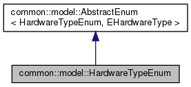
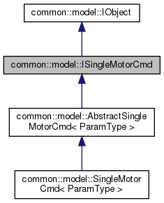

Common
=====================================

| The Common package defines the common software components of the low level stack. It is split into a model part and a utility part:
| - The 'model' subpackage defines the model tree needed to keep a virtual state of the robot up to date at any time.
| - The 'util' subpackage defines cpp interfaces and useful functions

Model
--------------------------
The model subpackage is comprised of:

States
**************************
Classes, to represent the virtual state of each hardware component at any moment. 
The hierarchy allows powerful polymorphism so that we can interpret each component differently based on the information we need to obtain. 

.. figure:: ../../../images/stack/low_level/classcommon_1_1model_1_1AbstractHardwareState__inherit__graph.png
   :alt: Abstract Hardware State inheritance graph 
   :height: 400px
   :align: center

   Abstract Hardware State inheritance graph 

Enums
**************************
Enhanced enums, to keep trace of various enumeration and be able to have useful utilities attached to them (like conversion in string).

   Hardware Type Enum inheritance graph

Commands
***************************
Classes representing single and synchronize commands, for steppers and dynamixels. They are needed in queues in the ttl_driver and can_driver packages.

.. |picSync| image:: ../../../images/stack/low_level/classcommon_1_1model_1_1ISynchronizeMotorCmd__inherit__graph.png
   :alt: ISynchronizeMotorCmd inheritance graph
   :width: 200px
   
.. table:: Commands graphs
   :widths: auto
   :align: center

   ============  ===========
   |picSingle|    |picSync|
   ============  ===========
    Single Cmd    Sync Cmd
   ============  ===========

Each type of command is an alias to specified versions of two base template classes: AbstractSynchronizeMotorCmd and AbstractSingleMotorCmd

Util
--------------------------
The util subpackage is comprised of:

* Cpp interfaces, used globally in the stack for polymorphism for instance
* Utility functions usable globally in the stack

Dependencies
--------------------------
This package does not depend on any package.
This package is a dependency of the following packages:

* can_driver
* conveyor_interface
* cpu_interface
* end_effector_interface
* joints_interface
* niryo_robot_hardware_interface
* tools_interface
* ttl_driver

.. |namespace_cpp| replace:: common
.. |package_path| replace:: ../../../../niryo_robot_hardware_stack/can_driver
