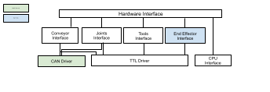

Niryo Robot Hardware Interface
=======================================

| This package handles packages related to the robot's hardware.
| It launches hardware interface nodes, motors communication and driver.  

   Global overview of hardware stack packages organization.

Hardware interface Node
--------------------------

This node has been conceived to instantiate all the interfaces we need to have a fully functional robot. 

Among those interfaces we have:
 - Conveyor Interface
 - Joints Interface
 - Tools Interface
 - Cpu Interface
 - End Effector Interface (Ned2 only)
 - Can Driver (Ned and One Only)
 - Ttl Driver

It belongs to the ROS namespace: |namespace_emphasize|.

Parameters
^^^^^^^^^^^^^^^^^^^^^^^^^^^^^^^^^^^^^^^^

.. list-table:: Hardware Interface's Parameters
   :header-rows: 1
   :widths: auto
   :stub-columns: 0
   :align: center

   *  -  Name
      -  Description
   *  -  ``publish_hw_status_frequency``
      -  | Publishes rate for hardware status.
         | Default : '2.0'
   *  -  ``publish_software_version_frequency``
      -  | Publishes rate for software status.
         | Default : '2.0'

Dependencies
^^^^^^^^^^^^^^^^^^^^^^^^^^^^^^^^^^^^^^^^

- :doc:`tools_interface`
- :doc:`joints_interface`
- :doc:`conveyor_interface`
- :doc:`cpu_interface`
- :doc:`../high_level/niryo_robot_msgs`

Services, Topics and Messages
-------------------------------------------------

Published topics
^^^^^^^^^^^^^^^^^^^^^^^^^^^^^^^^^^^^^^^

.. list-table:: Hardware Interface's Published Topics
   :header-rows: 1
   :widths: auto
   :stub-columns: 0
   :align: center

   *  -  Name
      -  Message Type
      -  Description
   *  -  ``hardware_status``
      -  :ref:`niryo_robot_msgs/HardwareStatus<source/stack/high_level/niryo_robot_msgs:HardwareStatus>`
      -  Motors, bus, joints and CPU status
   *  -  ``software_version``
      -  :ref:`niryo_robot_msgs/SoftwareVersion<source/stack/high_level/niryo_robot_msgs:SoftwareVersion>`
      -  Software version of the Raspberry PI and every hardware components (motors, end effector, conveyors and tools)

Services
^^^^^^^^^^^^^^^^^^^^^^^^^^^^^^^^^^^^^^^

.. list-table:: Hardware Interface Package Services
   :header-rows: 1
   :widths: auto
   :stub-columns: 0
   :align: center

   *  -  Name
      -  Message Type
      -  Description
   *  -  ``launch_motors_report``
      -  :ref:`source/stack/high_level/niryo_robot_msgs:Trigger`
      -  Starts motors report
   *  -  ``reboot_motors``
      -  :ref:`source/stack/high_level/niryo_robot_msgs:Trigger`
      -  Reboots motors
   *  -  ``stop_motors_report``
      -  :ref:`source/stack/high_level/niryo_robot_msgs:Trigger`
      -  Stops motors report

.. |namespace_cpp| replace:: niryo_robot_hardware_interface
.. |namespace| replace:: /niryo_robot_hardware_interface/
.. |namespace_emphasize| replace:: ``/niryo_robot_hardware_interface/``
.. |package_path| replace:: ../../../../niryo_robot_hardware_stack/niryo_robot_hardware_interface
