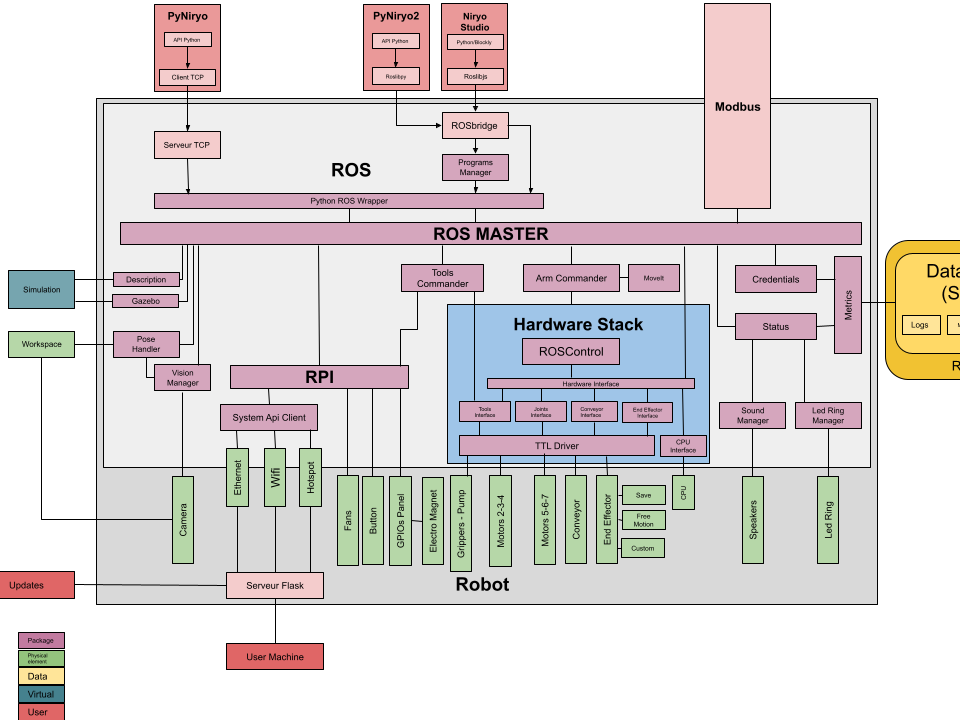

Overview
=========================================

Ned is a robot based on Raspberry, Arduino & ROS. It uses ROS to
make the interface between Hardware and high-level bindings.

On the following figure, you can see a global overview of the Niryo's robot software
in order to understand where are placed each part of the software.

   Niryo robot v3 software

.. figure:: ../../images/ros_logo.png
   :alt: ROS Logo
   :width: 150px
   :align: center

   ROS Logo

ROS (Robot Operating System) is an Open-Source Robotic Framework which
allows to ease robot software development. The framework is used
in almost each part of Ned's software.

The Stack is split into two parts:

- The :doc:`high_level` (motion planner, vision, ...), developed in Python to give good readability 
- The :doc:`low_level` (drivers, hardware management, ...), developed in C++ to ensure real time capabilities.

.. note::
   To learn more about ROS, go on `Official ROS Wiki <http://wiki.ros.org/>`_.